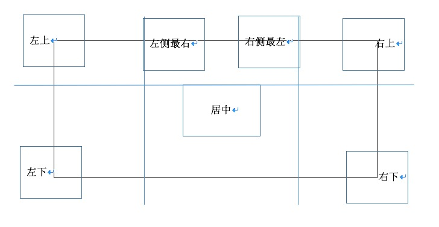

# gallery-by-react

分析图片的变换区间:



左分区:
```
x > 0 - imgFigure.width / 2;
x < stage.width / 2 - imgFigure.width / 2 * 3;
y > 0 - imgFigure.height / 2;
y < stage.height - imgFigure.height / 2;
```

右分区:

```
x > stage.width / 2 + imgFigure.widht / 2;
x < stage.width - imgFigure.width / 2;
y > 0 - imgFigure.height / 2;
y < stage.height - imgFigure.height / 2;
```

上分区:

```
x > stage.width / 2 - imgFigure.width;
x < stage.width / 2;
y > 0 - imgFigure.height / 2;
y < stage.height / 2 - imgFigure.height / 2 * 3;
```

下半分区由于要设计导航,所以避免遮挡,不放置图片。


[demo](https://luojinghui.github.io/gallery-by-react/src/index.html)
